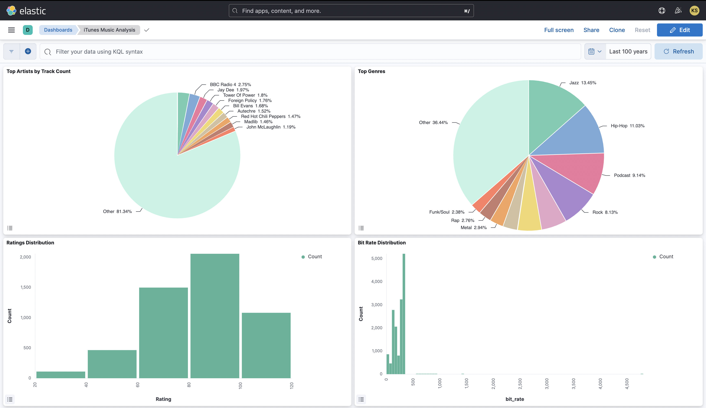
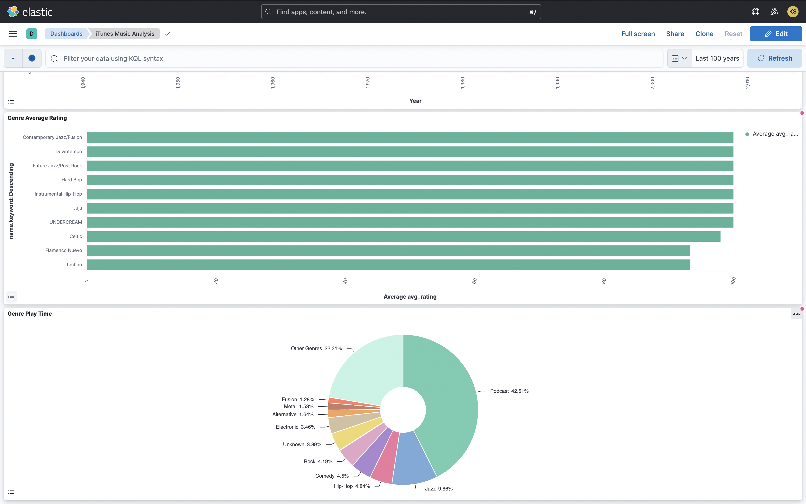
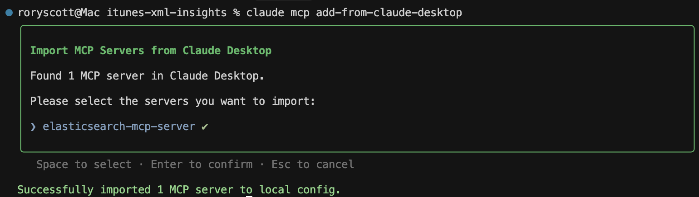
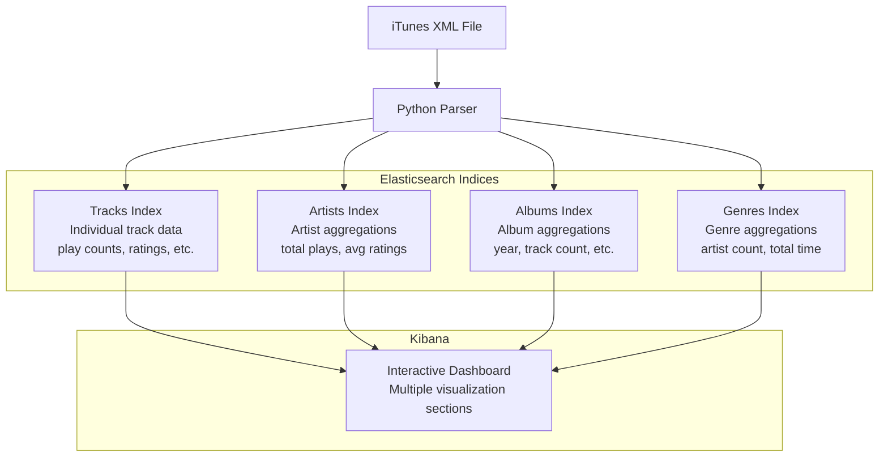

# iTunes XML Insights

Analyze your iTunes XML library data using Elasticsearch and Kibana to visualize your music listening habits.

## Overview

This project provides a comprehensive analytics solution for your iTunes library data, allowing you to explore your music collection through interactive visualizations.

<div style="display: flex; justify-content: space-between; margin-bottom: 20px;">
    
    
</div>

The system extracts data from your iTunes XML export file, transforms it into structured indices, and presents it through customized Kibana dashboards.


## Features

- Parse iTunes XML library export
- Ingest music library data into multiple Elasticsearch indices
- Pre-aggregated artist, album, and genre data for fast analytics
- Comprehensive Kibana dashboard with multi-level insights
- All containerized with Docker, no local installs needed

### Claude MCP

To register the elasticsearch mcp in your claude desktop app, you can run the following.

```sh
roryscott@Mac itunes-xml-insights % npx -y @smithery/cli@latest install elasticsearch-mcp-server --client claude
✔ Successfully resolved elasticsearch-mcp-server
Installing remote server. Please ensure you trust the server author, especially when sharing sensitive data.
For information on Smithery's data policy, please visit: https://smithery.ai/docs/data-policy
? The host URL of the Elasticsearch cluster. (required) http://localhost:9200/
? The password for Elasticsearch authentication. (required) <insert-password-here>
? The username for Elasticsearch authentication. (required) elastic
elasticsearch-mcp-server successfully installed for claude
```

If you then want to access this via Claude Code, you can run the following:



## Prerequisites

- Docker and Docker Compose installed
- iTunes XML library export file (typically named "iTunes Music Library.xml")
- File needed in root directory:
  ```
  # iTunes Music Library XML file - found in /Users/username/Music/iTunes/ 
  # for macOS, not sure about Windows
  iTunes Music Library.xml
  ```

## Setup

1. Make sure Docker and Docker Compose are installed on your system

2. Place your iTunes XML library file in the project root directory (named "iTunes Music Library.xml")

3. Run the setup script:
   ```
   ./setup.sh
   ```
   
   This script will:
   - Start Elasticsearch and Kibana containers
   - Build a Python container with dependencies installed using `uv` (faster than pip)
   - Import your iTunes data into multiple Elasticsearch indices
   - Create a comprehensive Kibana dashboard

4. Access your dashboard directly at:
   ```
   http://localhost:5601/app/dashboards#/view/itunes-analysis
   ```

## Data Model

The system creates four Elasticsearch indices to efficiently store and analyze different aspects of your music library:



Note that [analyze_xml.py](analyze_xml.py) was written to help understand the structure. It can be used without local venv by running `uvx python analyze_xml.py`

## Kibana Dashboard

The system automatically sets up a comprehensive Kibana dashboard organized into sections:

### Track Visualizations
- Top Artists by Track Count
- Top Genres Distribution
- Ratings Distribution
- Bit Rate Distribution (audio quality)

### Artist Visualizations
- Top Artists by Play Count
- Top Artists by Average Rating

### Album Visualizations
- Top Albums by Play Count
- Albums by Year Distribution

### Genre Visualizations
- Genre Average Rating
- Genre Play Time (total hours)

No manual setup required!

## Using the Dashboard

1. View Track Statistics: See distribution of tracks by various dimensions
2. Explore Artist Insights: Identify your most played and highest-rated artists
3. Analyze Albums: Discover which albums you listen to most and their release years
4. Compare Genres: Compare ratings and total listening time across genres

## Command Reference

Use the Makefile for easy management:

```
make setup        # Set up the complete system
make dashboard    # Set up Kibana dashboard
make clean        # Remove all containers and data
make reset        # Tear down and set up from scratch
```

## Technical Details

- Multi-index Elasticsearch structure for efficient analytics
- Uses `uv` for fast Python dependency management
- Docker containers for complete isolation and reproducibility
- Pre-aggregated data for rapid visualization rendering
- Support for ratings, play counts, and other iTunes metadata

## Future Plans

- Add machine learning insights using Elasticsearch ML
- Create recommendation engine based on listening patterns
- Incorporate vector embeddings for song similarity analysis
- Add time-based trends and seasonal listening patterns

Claude helped build and enhance this project.